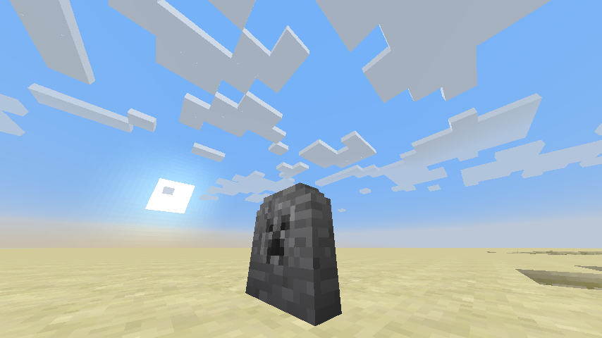
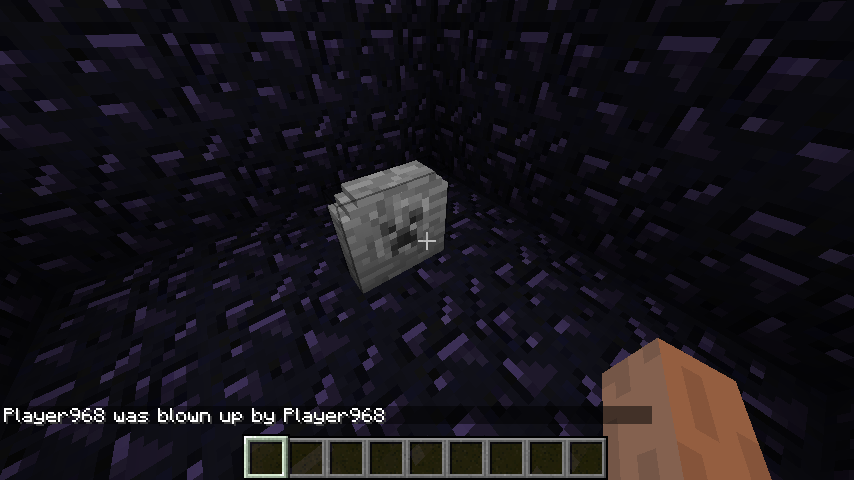

# OpenGrave
#### A lightweight mod that just adds a gravestone. No frills.
[Download latest v3.0 (1.12.2)](https://github.com/Yopu/OpenGrave/releases/download/3.0/OpenGrave-1.12.2-3.0.jar)

[Download v2.0 (1.8.9)](https://github.com/Yopu/OpenGrave/releases/download/2.0/OpenGrave-1.8.9-2.0.jar)

[Download v1.5 (1.7.10)](https://github.com/Yopu/OpenGrave/releases/download/1.5/OpenGrave-1.7.10-1.5.jar)

* Updated to 1.12.2!
* New block model!
* Added death method on right click!

#### Edits in this fork
* Correctly puts armor, baubles and offhand items on
* Takes less time to break the grave block

## Building this
Good luck, but I'll be nice and will leave some hints:
- Download and install Forge v14.23.3.2655 (a really ooooold version)
- Find `forge-14.23.3.2655.jar` (or similar) and put in gradle cache
- If needed, update the repositories in `build.gradle`

